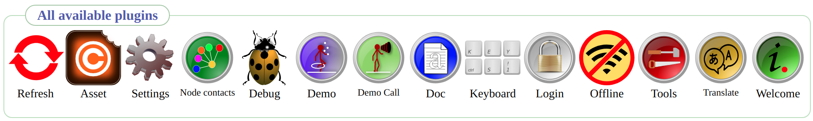

# What is Infohub?
Audience: You  
Read time: 4 minutes (double that if the puppy want attention)

Hi. My name is [Peter](https://www.linkedin.com/in/peter-lembke-4b607293/) and I am the creator of [Infohub](https://infohub.se/).

Infohub is your private hub on the Web. You can store private information. Only you can read your information in your browser.

Home page: https://infohub.se/

## Web application
You can run your own Infohub web site or be invited by a trusted friend to become a user on her Infohub web site. Developers can create applications that you can install into your Infohub.

## Trust
Infohub encrypt your data in the browser before it is sent to the server for storage. The server can not decrypt your data. The login procedure never reveal any secrets.

Infohub is open source. You can see and review the code at Github.
Source code: [https://github.com/peterlembke/infohub](https://github.com/peterlembke/infohub)

## What can Infohub do?
There are only a few applications installed from start.

[Welcome](https://github.com/peterlembke/infohub/blob/master/folder/plugins/infohub/welcome/infohub_welcome.md) give you an idea of what you can do with Infohub as a user and as a developer.

[Demo](https://github.com/peterlembke/infohub/blob/master/folder/plugins/infohub/demo/infohub_demo.md) will show you what Infohub can do. Tools are smaller features that can be useful. For example a password generator. Settings, here you can set the zoom level and preferred languages. 

[Login](https://github.com/peterlembke/infohub/blob/master/folder/plugins/infohub/login/infohub_login.md) have features that handle your login account.
 
[Offline](https://github.com/peterlembke/infohub/blob/master/folder/plugins/infohub/offline/infohub_offline.md) will download all applications and assets you have rights to so you can run Infohub without Internet for a while.

__Developers__ can use the [Translate](https://github.com/peterlembke/infohub/blob/master/folder/plugins/infohub/translate/infohub_translate.md) tool on any application to support other languages. I usually support Spanish, English and Swedish. Developers can also see how calls are used in [Demo Call](https://github.com/peterlembke/infohub/blob/master/folder/plugins/infohub/democall/infohub_democall.md), find full documentation in [Doc](https://github.com/peterlembke/infohub/blob/master/folder/plugins/infohub/doc/infohub_doc.md), clear caches in [Debug](https://github.com/peterlembke/infohub/blob/master/folder/plugins/infohub/debug/infohub_debug.md). Your application can subscribe to key combinations with [Keyboard](https://github.com/peterlembke/infohub/blob/master/folder/plugins/infohub/keyboard/infohub_keyboard.md).

__Site owners__ can administrate login accounts in [Node contacts](https://github.com/peterlembke/infohub/blob/master/folder/plugins/infohub/contact/infohub_contact.md).

[Assets](https://github.com/peterlembke/infohub/blob/master/folder/plugins/infohub/asset/infohub_asset.md) give credit to the creators of all graphics and sounds used in Infohub. Each asset has a license file and you can see all information here.

## What do I need to use Infohub?
You need a computer or chromebook or telephone or tablet that can run a modern web browser.

Infohub works in Chrome, Firefox, Safari and probably in all browsers that are based on any of them.

The screen size does not matter. During development I use iPhone SE 2016 as a reference phone. It has a 4” screen. I also use Linux with Chrome, Firefox and Opera on a big UHD screen. And a MacOS laptop with Safari.

Infohub is very conservative with the number of requests and the amount of data downloaded from the server but still you need at least a slow 3G or better. Data are stored in the browser and are reused.

## What do I need to host Infohub?
You need a normal web hotel. Infohub have been tested on Apache 2 web server and PHP 7.3 or 7.4. You also need some database. Infohub support right now MySQL, MariaDB, SQLite, PostgreSQL.

If you are comfortable with installing your own server you can run Infohub on a Raspberry Pi3. I use Pi3 during development.

## What do I need to develop applications in Infohub?
You need basic development skills and know some copy and paste. The code is very similar between PHP and Javascript and uses clean commands. Some would say it looks like Basic.

There is a template in Javascript and a template in PHP that get you started. You can peek at the existing applications or read the documentation.

---

That was all for this introduction to Infohub.
Best regards, Peter Lembke

